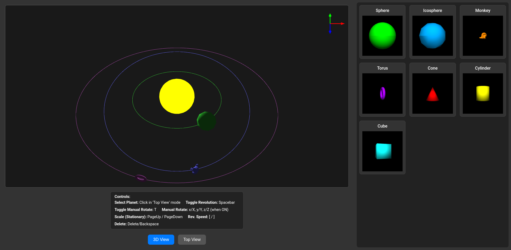
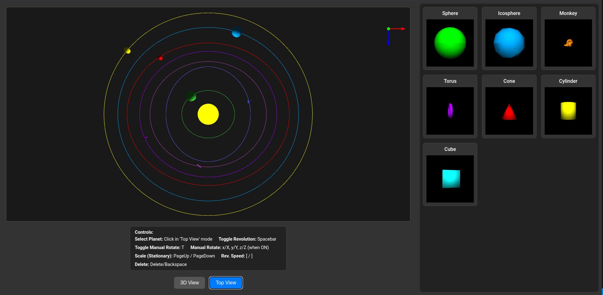

# 3D Star System Generator (WebGL)

This project is a 3D interactive star system generator built with raw WebGL and JavaScript for the CS606 Programming Assignment 2. It renders a star and a set of orbiting planets, with full camera controls, object picking, and dynamic transformations.

## ✨ Features

### 3D Scene & Rendering

  * **Star System:** Renders a central, emissive (glowing) star and 3+ planets.
  * **Elliptical Orbits:** Planets revolve around the star in unique, concentric, and non-colliding elliptical orbits.
  * **Orbit Paths:** The elliptical path for each planet is rendered as a colored line.
  * **Model Loading:** Loads all 3D models (`.ply` format) on startup.

## ScreenShots




### Camera & View

  * **Dual-Mode Camera:** Toggle between a "Top View" (orthographic) and a "3D View" (perspective) with one key.
  * **3D Trackball:** The 3D view uses a quaternion-based arcball/trackball camera, allowing for smooth, arbitrary rotations around the origin.
  * **Orientation Gizmo:** A 3D axis gizmo (like in Blender) is rendered in the top-right corner and mirrors the main camera's orientation.

### Interactivity & Controls

  * **Object Picking:** In "Top View," you can click on any planet to select it. This is implemented using a pixel-perfect, off-screen framebuffer (FBO) technique.
  * **Highlighting:** The selected planet is highlighted with a distinct white color.
  * **Add/Delete Planets:**
      * **Add:** Click on a model in the right-hand sidebar to add a new planet with a unique, randomly-generated orbit.
      * **Delete:** Press `Delete` or `Backspace` to remove the selected planet (a minimum of 3 planets is enforced).
  * **Animation Control:**
      * `Spacebar`: Toggles the automatic revolution (orbiting) of all planets.
      * `T`: Toggles "Manual Rotation Mode" for the selected planet.
  * **Planet Transformations (for selected planet):**
      * **Revolution Speed:** `[` (slower) and `]` (faster).
      * **Manual Rotation:** (When `T` is on) Use `x/X`, `y/Y`, and `z/Z` keys.
      * **Scaling:** (When `Spacebar` is off) Use `PageUp` and `PageDown` to scale a stationary planet. It resumes its original size when revolution is turned back on.

## 🗂️ Project Structure

```
.
├── Objects/
│   ├── cone.ply
│   ├── cube.ply
│   ├── cylinder.ply
│   ├── icosphere.ply
│   ├── monkey.ply
│   ├── sphere.ply
│   └── torus.ply
├── gizmoRenderer.js     # Manages the 3D axis gizmo
├── GameObject.js        # Class for a single renderable 3D object
├── index.html           # Main HTML file (contains all CSS)
├── index.js             # Main script: initializes GL, loads models, starts loop
├── InputHandler.js      # Module for all keyboard/mouse event listeners
├── ObjectPicker.js      # Manages the FBO for object picking
├── OrbitRenderer.js     # Manages drawing the elliptical orbit lines
├── OrbitShaders.js      # GLSL shaders for the orbit lines
├── PlanetSelection.js   # Manages the right-hand sidebar UI
├── PLYLoader.js         # Utility for parsing .ply model files
├── Shaders.js           # GLSL shaders for the main 3D objects (phong-style)
└── ShaderUtil.js        # Utility for compiling/linking all shader programs
```

## 🚀 How to Run

This project must be run from a local web server because it uses `fetch()` to load 3D models, which is blocked by browser CORS policies if you open `index.html` directly from the filesystem.

Open a terminal in the project's root directory.

If you have Python 3, run:

```bash
python -m http.server
```

Open your browser and navigate to http://localhost:8000.

-----

## 📝 Report Q\&A (Draft)

Here are draft answers to the questions from the assignment PDF, based on the provided code.

**1. To what extent were you able to reuse code from Assignment 1?**

> (This is a guess, as I haven't seen A1)
> Very little code was reused. Assignment 1 focused on 2D rendering, so while the concepts of buffers and shaders are similar, the implementation for 3D is substantially different. The main reusable components were the basic WebGL context initialization and the shader compilation functions, which have now been modularized into `ShaderUtil.js`.

**2. What were the primary changes in the use of WebGL in moving from 2D to 3D?**

  * **Matrices:** We moved from 2D (x, y) coordinates to 3D (x, y, z) coordinates. This required three separate matrices (Model, View, Projection) instead of a single 2D transformation matrix.
  * **Depth:** We enabled the `DEPTH_TEST` (`gl.enable(gl.DEPTH_TEST)`) and must clear the `DEPTH_BUFFER_BIT` each frame. This is crucial for rendering 3D objects in the correct order so objects in front occlude objects behind.
  * **Camera:** A 3D camera system was implemented. The "View" matrix represents the camera. In 3D, this is a complex system involving a position, a target, and an "up" vector, which we manage with `mat4.lookAt`.
  * **Lighting:** In 2D, color is often flat. In 3D, we implemented a basic phong-style lighting model in the fragment shader (`Shaders.js`). This requires vertex normals (`a_Normal`) and a light position (`u_LightPosition`) to calculate diffuse light.
  * **Models:** We are no longer drawing simple 2D shapes (triangles/squares) but loading complex 3D meshes from `.ply` files.

**3. How were the translate, scale and rotate matrices arranged? Can your implementation allow rotations and scaling during the movement?**

  * **Arrangement:** The transformations are applied in the `StarSystem.js` `_update` loop. The final Model matrix (`M`) is created by combining separate matrices for Translation, Rotation, and Scale. The order of multiplication is:
    `M = Translation * Rotation * Scale`
    This ensures that the object is scaled in its local space, then rotated around its own center, and finally moved to its correct position in the orbit.
  * **Allow during movement?**
      * **Rotation:** *Yes.* The architecture allows it. Planets *could* be rotated while moving (as they were in a previous version), but this was *disabled* to meet the assignment requirement that "only axis-rotation or revolution can happen at a time."
      * **Scaling:** *No.* The implementation *explicitly* prevents this. The code checks `if (!this.isRevolving)` before applying the `tempScale`. This fulfills the requirement that the planet "resume its original size when it starts moving."

**4. How did you ensure that there are no conflicts when adding/deleting a planet along with its orbit?**

  * **Adding:** Conflicts are avoided by finding the largest existing orbital radii. In `StarSystem.js`, the `addModel` function iterates over all planets to find the `maxA` and `maxB` (x and z radii). It then creates the new planet's orbit by adding a random offset to these maximums, ensuring the new orbit is always larger than all existing ones and cannot overlap.
  * **Deleting:** This is managed safely. When `deleteSelected` is called, the program finds the `planetProp` object. It then explicitly calls `this.orbitRenderer.removeOrbit(planetProp.orbitMesh)` to delete the WebGL buffer for the orbit line, and finally filters the planet from the `this.planets` array. This ensures both the 3D model and its orbit line are removed, and the selection is cleared. A check also prevents deletion if there are 3 or fewer planets.